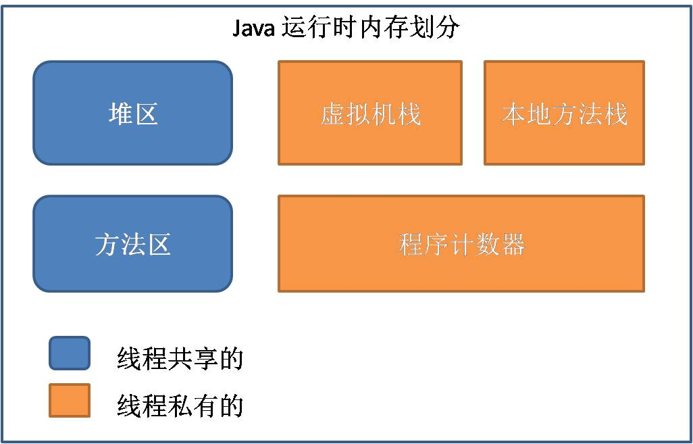

## **Android Interview**

## **Java**
##### Java封装，继承，多态的理解
- 封装：将对象的信息隐藏在对象内部，不允许外部程序直接访问对象内部信息，而是通过提供的方法来说实现内部信息的操作和访问,java 提供private,protected,public,default字段来控制外部访问权限
- 继承：子类是父类的拓展，子类是是一种特殊的父类，获得父类全部属性和方法（但是不能直接访问private）
- 多态：多态主要体现在重载，方法重载（同个方法不同参数），方法覆盖（子类重写父类方法），运行时多态（子类和父类相互转换）

##### Java虚拟机及作用
Java虚拟机实质上是一个执行Java字节码的进程，当Java源文件编译成Java字节码文件在Java虚拟机上运行，因此成为“平台无关性”，任何平台只要安装Java虚拟机就可以运行Java代码。注意：可以存在**多个虚拟机**

##### Java内存机制
[资料](http://www.cnblogs.com/hnrainll/archive/2013/11/06/3410042.html)

由上面图可以总结：
- 程序计数器：当前线程执行字节码的状态
- 栈内存
 - 虚拟机栈：Java方法执行的内存模型，内存成员：`基本数据类型`和`对象引用`
 - 本地方法栈：与虚拟机栈类似,主要为虚拟机使用到的Native方法服务
- 堆内存：存放对象实例和数组（栈里面的对象引用指向堆内存，但是并不能所有直接使用）,gc主要运行的地方
- 方法区：存储被虚拟机加载的类信息，final常量，Static变量，编译代码等，其中还包含了运行时常量池，一般是String

##### 对象创建过程
Java语言层面，通过关键字new 创建对象，虚拟机中，遇到new指令后执行以下操作:
1. 判断类是否加载、解析、初始化： 先检查常量池是否能定位该类的符号引用，检查符号引用代表类是否已被加载、解析和初始化过，若是没有，那么先执行类加载
2. 为新对象分配内存：在Java堆中划分一块确定大小的内存出来。

##### 内存回收器
**常用的垃圾对象判定算法：**
1. 引用计数
 - 概述：给对象添加一个引用计数器，每次引用这个对象，计数器加1，引用失效则减1
 - 优点：简单，判定效率高
 - 缺点：难以解决对象之间循环引用问题，a=b,b=a
 - 应用：python  
 
2. 可达性分析
 - 概述：从GC Roots作为起点，向下搜索他们的引用对象，可以生成一个引用树，树的节点视为可达对象，反之则视为垃圾回收
 - 应用：Java

**Java中GC Roots包括：**
1. 虚拟机栈中的引用对象
2. 方法区中静态属性引用的对象
3. 方法区中常量引用的对象
4. 本地方法栈中JNI引用的对象
5. 并非所有不可达对象都会回收，在垃圾回收前JVM会执行finalize方法，使对象变为可达，不被回收，但是队形的finalize方法只会执行一次

**垃圾回收算法**
1. 标记回收法：记录可达到对象，删除不可达到对象，一般有可能会出现内存碎片
2. 标记-压缩回收法：与标记回收法一样，最后将存活对象压缩到栈的一端，将碎片合成大块可再利用的的内存区域
3. 复制回收法：把内存空间分为两部分，gc运行时把可达对象复制到另外一边，最后删除所有对象，这种方法适合短期性对象
4. 分代回收法：把内存分为两个或者多个，如年轻代，老年代，年轻代对象回收比较快使用效率高的算法，当对象多次存货后将转移到老年代空间，老年代采用标记压缩算法

**Java中引用类型**
1. 强引用：对象使用内存不会回收，即使是内存不足时。常用 Object ob = new Object()
2. 软引用：保证在内存不足前将内存回收
3. 弱引用：适用生存期长，占用资源不高，垃圾回收器遇到就清除，但是一般垃圾回收器优先级较低
4. 虚引用

**内存泄漏和溢出**   
泄漏：无法释放对象内存空间，应用中内存泄漏有可能会引起溢出  
溢出：oom，超过内存大小

| type          | 大小  |
|-------------- | ----  |
| byte          |  1    |
| boolean       |  1    |
| short         |  2    |
| char          |  2    |
| int           |  4    |
| float         |  4    |
| double        |  8    |
| long          |  8    |

**内部类**
1. 成员内部类，可以任意使用外部类，但是需要外部类先创建
2. 静态内部类：只能调用外部类静态变量和方法

##### Static关键字
当类被载入虚拟机时就会初始化，内存分配在堆里面，对所有线程共享，对于类的普通方法和静态方法进行加锁区别：
1. 普通方法：加锁的主要类型是对象，所以只对同一个对象有效
2. 静态方法：静态方法存放在方法区，适合所有对象

##### 线程
**线程状态**
1. 就绪状态
2. 运行状态
3. 等待状态
4. 睡眠状态
5. 阻塞状态 io阻塞、同步阻塞
6. 死亡状态

**sleep，join,wait区别**
- sleep:Thread类的方法，线程暂停一段时间，但是不释放对象锁
- join:Thread类的方法，一个线程等待另外一个线程完成后才执行
- wait:Object类的方法，等待释放对象锁，需要notify唤醒，具体流程：从对象等待池移走任意一个线程队列到锁标志等待池中，只有在锁标志位等待池的线程才能被唤醒，notifyAll是将所有线程转移到锁标志位等待池

**线程同步**
1. synchronized
2. wait/notify/notifyAll
3. lock

**线程池**
1. newCachedThreadPool:可缓存线程池，若线程池长度超过处理需要，则灵活回收空闲线程，若无可回收则新建线程
2. newFixedThreadPool:创建定长线程池，控制线程最大可并发数，超过线程会在队列中等待
3. newScheduledThreedPool:创建定长线程池，支持定时及周期性任务执行
4. newSingleThreadExecutor:单线程线程池，每次都是唯一工作线程来执行任务，并保证(FIFO，优先级,LIFO顺序执行)

#### 集合类
**集合类基本接口**
1. Collection: 代表一组对象，各个对象都是其子元素
2. Set:不包含重复元素的Collection
3. List:有顺序的Collection,每个都是其子元素
4. Map:key-value

**HashMap和HashTable区别**
- HashMap:效率高，非线程安全，允许空键值
- HashTable:效率低，线程安全，不允许空键值

#### 字符串
**String、StringBuffer、StringBuilder区别**
- String:对象不可变，每次都会指向新对象
- StringBuffer:可持续添加字符，线程安全，效率低，适用于多线程
- StringBuilder:可持续添加字符，非线程安全，效率高，试用与多线程

**==、equals、hashCode区别**
- ==：比较两个对象的JVM地址
- equals: 比较两个对象内容是否相等，属于Object类方法，没有重写的话是使用`==`比较，若是重写的话需要结合hashCode使用
- hashCode:返回对象的内存地址，重写equals必须重写，一般比较都会先比较hashCode然后比较equals来提高效率，否则效率特别低

#### 异常
**Throwable、Error、Exception区别**
- Throwable是Error和Exception的父类
- Error：表示错误，系统级别
- Exception: 表示运行期间错误(Runtime)

#### 同步和异步区别
- 同步：阻塞，多线程共同完成一个任务，等待前一个任务完成后才执行下一个任务
- 异步：多线程完成任务，等待过程中可以处理其他任务，等待结果回来再处理

---
## **Android**
##### dvm的进程和Linux的进程, 应用程序的进程是否为同一个概念
Dvm的进程是dalivk虚拟机进程,每个android程序都运行在自己的进程里面,每个android程序系统都会给他分配一个单独的liunx uid(user id),每个dvm都是linux里面的一个进程.所以说这两个进程是一个进程.

##### android数字证书
android通过数字签名来标识应用程序的作者和在应用程序之间建立信任关系，不是用来决定最终用户可以安装哪些应用程序。这个数字签名由应用程序的作者完成，并不需要权威的数字证书签名机构认证，它只是用来让应用程序包自我认证的.

##### Android如何动态加载代码
**ClassLoader分类**
  1. BootClassLoader:系统启动时创建
  2. PathClassLoader:应用启动时创建,只能加载系统安装过的apk
  3. DexClassLoader:可以加载jar/apk/dex，可以在sd卡中加载未安装过的apk(插件化原理)

**ClassLoader加载特点（双亲代理模型）**
  1. 查询当前ClassLoader实例是否加载过此类，有就返回
  2. 如果没有，查询Parent是否加载过此类，如果已经加载过，直接返回Parent加载过的类
  3. 如果继承路线上的ClassLoader都没有加载，才由Child执行类加载工作

**优点：**
  1. 共享功能，一些Framework层级的类一旦被加载了，任何地方都不需要重新加载。
  2. 隔离功能，不同继承线路上的ClassLoader加载的类肯定不是同一个类，这样避免用户自己的类冒充核心类

**注意事项:**
  若是想要使用这种方式修复bug，则必须保证包含补丁dex文件先与旧dex加载，这样旧类才不会再加载，从而使用新的补丁类,若是使用不同ClassLoader可以加载旧类和新类，这样将会出现一些问题   
  同一个类 = 相同的ClassName + PackageName +　ClassLoader

**Android与Java程序使用上的区别:**
  1. Android许多组件都需要Manifest文件中注册才能工作，如果新加载进来的组件类没有注册的话，是无法运行的
  2. Res资源在Android开发中经常使用，这些资源用对应 id，运行时通过id从Resource获取对应的资源，如果动态加载进来的新类采用新的资源，那么会出现异常

##### 多进程问题
**两个相同的Activity,Application会有怎样的变化？**
  每个应用进程都会配备虚拟机，不同虚拟机在内存分配上有不同的地址空间，这就导致在不同的虚拟机中访问同一个类的对象会产生多份副本。

**如何开启开启新的进程**
  在AndroidManifest文件中，添加android:process=":demao",请中 : 代表应用程序的私有进程，私有进程名称会自动在 : 前加上包名，而全局进程不会，一般情况下，都是使用应用的私有进程

**多进程的优点及缺点**
  优点是分担主进程的内存压力，因为android内存限制主要限制虚拟机，每个虚拟机是进程，所以能分担内存压力，缺点是占用系统内存，容易导致内存占满手机卡顿的问题。

**多进程引起的问题**
  1. 静态成员和单例模式失效
  2. 线程同步机制完全失效
  3. SharePreferences可靠性下降
  4. Application会多次创建

**跨进程通信（IPC）**
  1. 使用Bundle
  2. 使用文件共享
  3. 使用Messager(例：service返回IBinder对象创建Messager,使用Messager向service发送消息，若客户端需要发消息，则创建Handler,通过Message的replyTo参数传递消息)
  4. AIDL
  5. ContentProvider
  6. Socket

##### AIDL的全称是什么？如何工作？
AIDL(Android Interface definition language)是一种接口描述语言; 编译器可以通过aidl文件生成一段代码，通过预先定义的接口达到两个进程内部通信进程的目的. 如果需要 在一个Activity中, 访问另一个Service中的某个对象, 需要先将对象转化成AIDL可识别的参数(可能是多个参数), 然后使用AIDL来传递这些参数, 在消息的接收端, 使用 这些参数组装成自己需要的对象.AIDL的IPC的机制和COM或CORBA类似, 是基于接口的，但它是轻量级的。它使用代理类在客户端和实现层间传递值.

**需要完成两件事情:**
  1.引入AIDL的相关类.
  2.调用aidl产生的class. AIDL的创建方法: AIDL语法很简单,可以用来声明一个带一个或多个方法的接口，也可以传递参数和返回值。由于远程调用的需要, 这些参数和返回值并不是任何类型.

**AIDL支持的数据类型:**
  1.不需要import声明的简单Java编程语言类型(int,boolean等)
  2.String, CharSequence不需要特殊声明
  3.List, Map和Parcelables类型, 这些类型内所包含的数据成员也只能是简单数据类型, String等其他比支持的类型.

##### handler机制的原理
andriod提供了Handler和Looper来满足线程间的通信。Handler先进先出原则。Looper类用来管理特定线程内对象之间的消息交换(MessageExchange)。   
  1. Looper:一个线程可以产生一个Looper对象，由它来管理此线程里的MessageQueue(消息队列).   
  2. Handler:你可以构造Handler对象来与Looper沟通，以便push新消息到MessageQueue里;或者接收Looper从MessageQueue取出)所送来的消息。    
  3. MessageQueue(消息队列):用来存放线程放入的消息。    
  4. 线程：UIthread通常就是mainthread，而Android启动程序时会替它建立一个MessageQueue.

##### ANR出现情况及如何避免
ApplicationNotResponding一般出现在Android主线程操作耗时操作所引发的情况。

**出现场景：**
  1.在5秒内没有响应输入的事件（例如:按键按下,屏幕触摸）
  2.BroadcastReceiver在10秒内没有执行完毕
  3.主线程操作io，网络请求，耗时计算，图片处理等

**避免ANR:**
  1.尽量不要在onCreate和onResume做耗时操作，采取：Handler+Thread 或者 AsyncTask的方式去异步进行（io,数据库，图片处理，网络）
  2.在BroadcastReceiver和Service也不要做耗时操作

从 /data/anr/traces.txt文件中获取ANR信息,留意thread.wait,thread.sleep等信息，找出关键行数即可

##### Fragment生命周期

##### Activity和Fragment生命周期对比

**根据上面生命周期图，可以得出以下结论：**
 1. onAttach()：当fragment和activity被关联的时候调用
 2. onCreateView():当创建fragmentUI初始化调用
 3. onActivityCreated():当activity的onCrate方法返回时调用
 4. onDestoryView():当fragmentUI被移除的时候调用
 5. onDetach():当fragment和activity关联时调用
 6. 其他生命周期则是跟activity生命周期一起调用
 7. 当activity处于Resumed状态时，可以自由添加和移除fragment,此时fragment的状态可以独立改变
