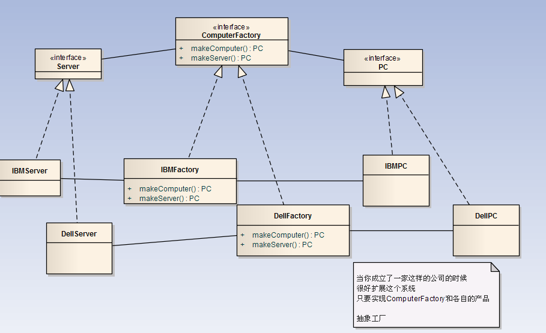

## 设计模式
[介绍](http://www.cnblogs.com/maowang1991/archive/2013/04/15/3023236.html)

#### 设计模式分类
创建型模式(五种)：工厂方法模式、抽象工厂模式、单例模式、建造者模式、原型模式          
结构型模式（七种）：适配器模式、装饰器模式、代理模式、外观模式、桥接模式、组合模式、享元模式      
行为模式（十一种）：策略模式、模板方法模式、观察者模式、迭代子模式、责任链模式、命令模式、备忘录模式、状态模式、访问者模式、中介模式、解释器模式    
还有两类：并发模式和线程池模式

#### 设计模式六大原则
1. 开闭原则
`对拓展开放，对修改关闭`,程序拓展时不能修改原有代码，要实现热拔插效果。类似：工厂方法
2. 里氏代换原则
 任何基类出现的地方，子类一定可以出现，继承是复用的基石，只有当衍生类可以替换基类，软件单位功能才不受影响，衍生类可以在基类的基础上添加新的功能。
3. 依赖倒转原则
 面向接口编程，依赖于抽象而不依赖于具体。
4. 接口隔离原则
 使用多个隔离的接口，优于使用单个接口，降低依赖，降低耦合
5. 迪米特法法则(最少知道原则)
 一个实体应当尽量少与其他实体之间发生相互作用，使得系统功能模块相对独立
6. 合成复用原则
 尽量使用合成和聚合的方式，而不是继承的方式

##### 创建型模式
**单例**
 - 介绍：整个类有且只有一个实例对象
 - 注意问题：
  1. 防止多线程多次创建
  2. 在不同的虚拟机中或进程中，单例将会失效

**工厂模式**
1. 简单工厂  
 - 介绍：公开一个static方法，构造产品
 - 特点：只有一个工厂，多个产品，1对多
 - 缺点：不利于拓展，破坏开闭原则

2. 工厂方法
  - 介绍：工厂有一个共同接口，不同工厂只生产同一等级的一种产品，相比于普通工厂，解耦不用判断
 - 特点：多个工厂，多个产品，一对一

3. 抽象工厂
 - 介绍：用来生产不同产品族的全部产品
 - [资料1](http://blog.csdn.net/superbeck/article/details/4446177) [资料2](http://bbs.csdn.net/topics/340257167)
    

**构造者模式(Builder)**
- 介绍：将创建对象各种参数收集管理，然后创建，有利于建造时修改参数

**原型模式**
- 介绍：根据对象作为原型，对其进行复制、克隆产生产生
- 复制分类：
  1. 浅复制：将一个对象复制后，基本数据类型的变量都会重新创建，而引用类型，指向的还是原对象所指向的
  2. 深复制：将一个对象复制后，不论是基本数据类型还有引用类型，都是重新创建的。    

##### 结构型模式

**适配器模式**
介绍：将某个类的接口转换成另外一种表示，目的是消除接口不匹配所造成的兼容性问题
`分类`：
  1. `类适配`
     使用新的Adapter类，继承原有方法，实现新方法（接口），例：110v 和 220v 充电标准，原来技术是220v，新的技术是沿用原来220v技术，实现新的110v充电技术

  2. `对象适配`
   使用新的Adapter类，实现接口，构造是传入源对象，使用源对象方法和实现新方法

**装饰器模式**
 介绍：从对象外部添加新功能
 优点：使用组合方式而非继承方式来拓展和复用新功能

**代理模式**
代理模式
 介绍：使用代理类，替原来对象进行一些操作，同时可以这个方法进行添加属性
 优点：在不修改源码的情况下，添加新功能
